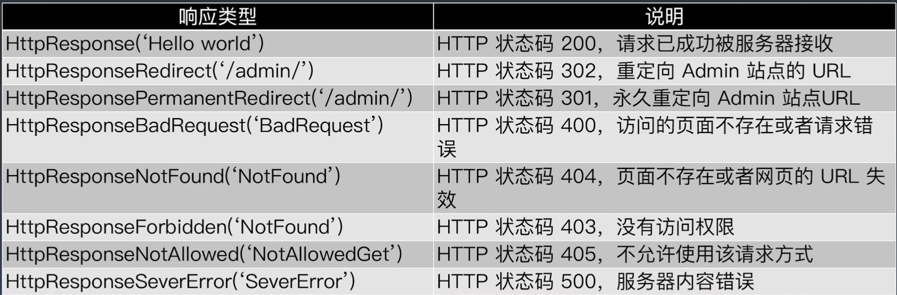
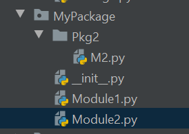

# Week 5 Django

Created: Jul 27, 2020 10:39 PM

### Notes

# Django introduction

## MTV framework

- Model
- Template
- View

## Django version

latest 3.0.  popular 2.2.13(LTS)

```jsx
pip install -Iv django==2.2.13
pip install --upgrade django==2.2.13
```

## Create project

```jsx
django-admin startproject MyDjango
```

### project structure

MyDjango/manage.py

MyDjango/MyDjango/settings.py

### create app

```jsx
python [manage.py](http://manage.py) startapp index
```

app structure

index/models.py

index/views.py

### run app

```jsx
python manage.py runserver -- default 127.0.0.1:8000
python manage.py runserver 0.0.0.0:80 -- other people can visit with port 80
quit running by using ctrl + c
```

## Django Settings(settings.py)

- INSTALLED_APPS  — add into the list for register own app
- MIDDLEWARE — hook, run from top to bottom, return from bottom to top
- ROOT_URLCONF
- TEMPLATES — can specify different template
- WSGI_APPLICATION
- DATABASES — can have multiple databases

## Django request lifecycle

1. HttpRequest has URLconf attribute, it will then be replaced by ROOT_URLCONF
2. load [urls.py](http://urls.py) and try to find the matched urlpatterns
3. if the pattern like path('', include('index.urls')), then django will further look up the [urls.py](http://urls.py) in the index APP
4. when finding the pattern then related view will be used and the view will get HttpRequest instance and parameters
5. if no pattern matched , exception will be thrown and error handling view page will be used

## URL config

1. get the root url in [setting](http://setting.py)s.py 
2. [urls.py](http://urls.py) will specify the url and view mapping 

    ```jsx
    path('',include('index.urls')),
    ```

3. keep looking until find the [views.py](http://views.py) return django.http.HttpResponse

## URL with variable

- single variable

```jsx
# urls.py
path('<[int:year](int:year)>', views.year), # 只接收整数，其他类型返回404

# views.py
def year(request, year):
    # return HttpResponse(year)
    return redirect('/2020.html')
```

- multiple variable (use **kwargs to get the passed in parameters)

```jsx
path('<int:year>/<str:name>', views.name),

def name(request, **kwargs):
    return HttpResponse(kwargs['year'])
```

- regex

```jsx
from django.urls import re_path
re_path('(?P<year>[0-9]{4}).html', views.myyear, name='urlyear') # the name attribute can be used in the template

def myyear(request, year):
    return render(request, 'yearview.html')  # render the html file

# yearview.html
<body>
	<div><a href="/2020.html">2020 booklist</a></div>
	<div><a href="">2020 booklist</a></div>
</body>
```

- customized type

```jsx
#*******************************************************************************
# converters.py
#*******************************************************************************
class IntConverter:
    regex = '[0-9]+'

    def to_python(self, value):  # url to python
        return int(value)

    def to_url(self, value):  # python to url (what to display in the url)
        return str(value)

class FourDigitYearConverter:
    regex = '[0-9]{4}'

    def to_python(self, value):
        return int(value)

    def to_url(self, value):
        return '%04d' % value

#*******************************************************************************
# urls.py
#*******************************************************************************
from django.urls import register_converter
from . import converters # converters is the customzied .py

register_converter(converters.IntConverter,'myint')
register_converter(converters.FourDigitYearConverter, 'yyyy')

# then we can use myint and yyyy as customize type
### 自定义过滤器
path('<yyyy:year>', views.year),
```

## View and Django shortcut function



### shortcut function

- render()  — render with template and return HttpResponse example: render(request, 'yearview.html')

The template page needs to be inside a folder called templates, this defined in the settings.py

- redirect() — for example used in the url redirection after login
- get_object_or_404()

## Model and database

- extends from django.db.models.Model

    ```jsx
    from django.db import models

    # Create your models here.
    # 图书or电影
    class Type(models.Model):
        # id = models.AutoField(primary_key=True)  # Django会自动创建,并设置为主键
        typename = models.CharField(max_length=20)

    # 作品名称和作者(主演)
    class Name(models.Model):
        # id 自动创建
        name = models.CharField(max_length=50)
        author = models.CharField(max_length=50)
        stars = models.CharField(max_length=11)
    ```

- django provides db access API

    ```jsx
    # django provide shell command
    # enter shell mode by python manage.py shell
    数据表的读写
    $ python manage.py  shell
    >>> dir()
    >>> from index.models import *
    >>> dir()
    >>> n = Name()
    >>> n.name='红楼梦'
    >>> n.author='曹雪芹'
    >>> n.stars=9.6
    >>> n.save() # after this a new record already in the database

    使用ORM框架api实现
    增
    >>> from index.models import *
    >>> Name.objects.create(name='红楼梦', author='曹雪芹', stars='9.6')
    >>> Name.objects.create(name='活着', author='余华', stars='9.4')

    查
    >>> Name.objects.get(id=2).name

    改
    >>> Name.objects.filter(name='红楼梦').update(name='石头记')

    删 
    单条数据
    >>> Name.objects.filter(name='红楼梦').delete()
    全部数据
    >>> Name.objects.all().delete()

    其他常用查询
    >>> Name.objects.create(name='红楼梦', author='曹雪芹', stars='9.6')
    >>> Name.objects.create(name='活着', author='余华', stars='9.4')
    >>> Name.objects.all()[0].name
    >>> n = Name.objects.all()
    >>> n[0].name
    >>> n[1].name

    >>> Name.objects.values_list('name')
    <QuerySet [('红楼梦',), ('活着',)]>
    >>> Name.objects.values_list('name')[0]
    ('红楼梦’,)
    filter支持更多查询条件
    filter(name=xxx, id=yyy)

    可以引入python的函数
    >>> Name.objects.values_list('name').count()
    2
    ```

- python class to sql table migration

    ```jsx
    $ python manage.py makemigrations # will just create a temp scripts for showing different version in the migrates directory
    $ python manage.py migrate # this will create tables

    ## because django is default to use MySqldb, it will cause many issues, especially it will looking for the version which is mysqldb's
    ## before run the above need to do the following things
    ## 1. add the following in the __init__.py inside the project
    # otherwise it won't run
    import pymysql
    pymysql.install_as_MySQLdb()

    ## 2. comment out the raise exception for the version check in \site-packages\django\db\backends\mysql\base.py
    if version < (1, 3, 13):
        pass
        # raise ImproperlyConfigured('mysqlclient 1.3.13 or newer is required; you have %s.' % Database.__version__)

    ## 3. comment out the decode which is not valid in python3 anymore in \site-packages\django\db\backends\mysql\operations.py
    def last_executed_query(self, cursor, sql, params):
            # With MySQLdb, cursor objects have an (undocumented) "_executed"
            # attribute where the exact query sent to the database is saved.
            # See MySQLdb/cursors.py in the source distribution.
            query = getattr(cursor, '_executed', None)
            #if query is not None:
                # query = query.decode(errors='replace')
            return query
    ```

## Django Templates

- template variable {{variable}}
- variable from url  — pass 2020 to variable urlyear
- from static resources 
- for tag  

    ```jsx
    # in the browser we reqeust for http://127.0.0.1:8000/books
    #################################################################
    # index\urls.py
    urlpatterns = [
        path('', views.index),
        re_path('(?P<year>[0-9]{4}).html', views.myyear, name='urlyear'),
        ### 带变量的URL
        path('<int:year>', views.year),  # 只接收整数，其他类型返回404
        path('<int:year>/<str:name>', views.name),
        # path('<myint:year>', views.year), # 自定义过滤器
        path('books', views.books),

    ]
    #################################################################
    # views.py
    def books(request):
        ###  从models取数据传给template  ###
        n = Name.objects.all()
        return render(request, 'bookslist.html', locals())

    #################################################################
    # booklslist.html
    <html>
    <head>
        <meta charset="UTF-8">
        <title>BooksList</title>
    </head>
    <body>

    
        <div>bookname: {{ book.name }}   <br>
               author: {{ book.author }} <br>
               stars:  {{ book.stars }}  
        </div>
    
    </body>
    ```

    return render(request, 'bookslist.html', locals()) notice there is locals() this is the python built in function which will return a dictionary containing the current scope's local variables.

- if tag 

## URLConf for mulitple application

- each sub path can registered into a APP for example [http://ip/douban/xxx](http://id/douban/xxx), [http://ip/douban/yyy](http://ip/douban/yyy) then you can create an APP called douban

    need to put / after the url path, for example: path('douban/',include('Douban.urls')),

- each APP should has its own [urls.py](http://urls.py) for the sub url path

## Database table to models

- python [manage.py](http://manage.py) inspectdb (this will not generate models.py, it will just show everything in the console)

    if not sure what command to use we can just use python [manage.py](http://manage.py) to show all commands

- python [manage.py](http://manage.py) inspectdb > models.py

    ```jsx
    # This is an auto-generated Django model module.
    # You'll have to do the following manually to clean this up:
    #   * Rearrange models' order
    #   * Make sure each model has one field with primary_key=True
    #   * Make sure each ForeignKey has `on_delete` set to the desired behavior.
    #   * Remove `managed = False` lines if you wish to allow Django to create, modify, and delete the table
    # Feel free to rename the models, but don't rename db_table values or field names.
    from django.db import models

    class T1(models.Model):
        id = models.BigAutoField(primary_key=True)
        n_star = models.IntegerField()
        short = models.CharField(max_length=400)
        sentiment = models.FloatField()

        # 元数据，不属于任何一个字段的数据
        class Meta:
            managed = False
            db_table = 't1'
    ```

    the generated [models.py](http://models.py) will have class Meta, and the managed set to False which is telling Django that when using migration command Django will skip this models

    db_table specify the table name, if not specify the tablename will be like `APPName_ModelClassName`. Because this [models.py](http://models.py) is generated from database table so it will call the table name anyway

## Writing Views

- in order to get the dataset we need to look up doc in the Model Layer section → QuerySet: 执行查询

    [https://docs.djangoproject.com/zh-hans/2.2/](https://docs.djangoproject.com/zh-hans/2.2/)

- 方法 all() 返回了一个包含数据库中所有对象的 QuerySet 对象。>>> all_entries = Entry.objects.all()
- filter() 返回一个新的 QuerySet，包含的对象满足给定查询参数。

    ```jsx
    # example 1
    Entry.objects.filter(pub_date__year=2006)

    # example 2
    queryset = T1.objects.values('sentiment')
    condtions = {'sentiment__gte': 0.5}  # sentiment is the column name double _ to separte the condition and column
    plus = queryset.filter(**condtions).count()
    ```

- aggregation

    ```jsx
    可以通过在 QuerySet 后添加 aggregate() 子句来计算 QuerySet 对象的汇总值。

    example 1: 
    >>> from django.db.models import Avg
    >>> Book.objects.all().aggregate(Avg('price'))
    {'price__avg': 34.35}
    本例中的 all() 是多余的，所以可以简化成这样的:

    >>> Book.objects.aggregate(Avg('price'))
    {'price__avg': 34.35}

    example 2:
    # 平均星级
    # star_value = T1.objects.values('n_star')
    # T1.objects.aggregate(Avg('n_star')) return a map the key will be n_star__avg
    star_avg =f" {T1.objects.aggregate(Avg('n_star'))['n_star__avg']:0.1f} "
    # 情感倾向
    sent_avg =f" {T1.objects.aggregate(Avg('sentiment'))['sentiment__avg']:0.2f} "
    ```

## Import bootstrap theme

- website: [https://startbootstrap.com/themes/](https://startbootstrap.com/themes/)
- take the sb admin 2 as example and view it on github [https://github.com/StartBootstrap/startbootstrap-sb-admin-2](https://github.com/StartBootstrap/startbootstrap-sb-admin-2)
- grab static resources like css, js,fonts and images into django APP's `static` folder and put html into the APP's `templates` folder
- create main page
    - in the template use extends to extends from a parent template ``
    - override the title block in parent `Welcome`
    - `` tell django need to load static resources, after that we can use static keyword to load static resources

        ```jsx
        <link rel="stylesheet" href="">
        ```

    - `{{ block.super }}` keep the parent block and extends based on the parent

        ```jsx
        
            {{ block.super }}
            <link rel="stylesheet" href="">
            <link rel="stylesheet" href="">
        
        ```

    - define the content `` which also will filled in the content section in the parent
    - in the [views.py](http://views.py) we already uses locals() to pass in the variables, in the templates we can just do something like {{counter}} to display the passed in counter variable

        ```jsx
        # results.html
        <div class="col-xs-9 text-right">
            <div class="huge">{{ counter }}</div>
            <div>评论数量</div>
        </div>
        ```

        ```jsx
        # views.py

        from django.shortcuts import render

        # Create your views here.
        from .models import T1
        from django.db.models import Avg

        def books_short(request):
            ###  从models取数据传给template  ###
            shorts = T1.objects.all()
            # 评论数量
            counter = T1.objects.all().count()

            # 平均星级
            # star_value = T1.objects.values('n_star')
            star_avg =f" {T1.objects.aggregate(Avg('n_star'))['n_star__avg']:0.1f} "
            # 情感倾向
            sent_avg =f" {T1.objects.aggregate(Avg('sentiment'))['sentiment__avg']:0.2f} "

            # 正向数量
            queryset = T1.objects.values('sentiment')
            condtions = {'sentiment__gte': 0.5}
            plus = queryset.filter(**condtions).count()

            # 负向数量
            queryset = T1.objects.values('sentiment')
            condtions = {'sentiment__lt': 0.5}
            minus = queryset.filter(**condtions).count()

            # return render(request, 'douban.html', locals())
            return render(request, 'result.html', locals())
        ```

    - prepare the piechart data ( this can be improved with Ajax)

        ```jsx
        ######################################################################
        # in template we put a placeholder for the piechart,
        # and put two dummy attribute having the data comes from the view
        <div id="morris-donut-chart" lg05={{plus}} lt05={{minus}}></div>

        ######################################################################
        # load up the related javascripts in the end of the template
        
            {{ block.super }}
            <script src=""></script>
            <script src=""></script>
            <script src=""></script>
        

        ######################################################################
        # in the morries-data.js we do the dynamic loading
        $(function() {
            // let lg05 = $("#lg05").html()
            // let lt05 = $("#lt05").html()

            let lg05 = $("#morris-donut-chart").attr('lg05')
            let lt05 = $("#morris-donut-chart").attr('lt05')
            Morris.Donut({
                element: 'morris-donut-chart',
                data: [{
                    label: "正向评价",
                    value: lg05
                }, {
                    label: "负向评价",
                    value: lt05
                }],
                resize: true
            });
        });
        ```

# Package and module



- import will default to find module from python/site-package
- to import another .py in the same folder we need to do **from . import Module1**
- stuff in the __**[init__**.py](http://init.py) will run immediately when you importing the package
- to import a module inside a package in the same directory we do from .Pkg2 import M2

# Homework

- get familiar with different field types in model layer

**SUMMARY:**